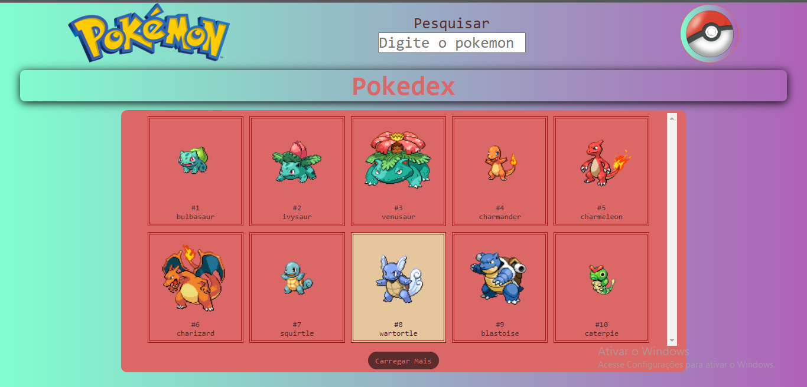

# Quest Avançada de React
Projeto realizado para prática de conceitos com objetivo acadêmico, projeto proposto pelo cruso @DevQuest para simular um teste Técnico.

<strong style="color:brown;">Prévia do design da Quest com detalhamento de suas Funcionalidades.</strong>

O objetivo da Quest foi construir em React uma lista com 10 pokémons retirado do <a  href="https://pokeapi.co/" target="_blank">PokeAPI</a> com seus nomes e imagens, podendo ser buscado + 10 pokemons a cada click realizado no botão posicionado ao final da lista. Cada quadrado que contém um pokemom pode ser clicavél, desta forma direcionando a outra página com informações especifícas(Nome, Tipo, Habiidades, ...) do pokémon clicado.

<a href="https://quest-react-avancado-chi.vercel.app/" target="_blank">Clique Aqui para ir direto para página</a>

## Tecnologias utilizadas
- Javascript
- React

### Conceitos Aplicados de cada Tecnologia
<ol>
    <li>Javascript
        <ul>
            <li>Utilização de Condicionais</li>
            <li>Utilização de Operadores Ternários</li>
            <li>Utilização de Higher Order Functions</li>
            <li>Utilização de Interpolação de String</li>
            <li>Utilização de Variáveis em diferentes tipos de Escopo</li>
            <li>Manipulando atributos com DOM </li>
            <li>Utilização de Eventos com DOM </li>
            <li>Utilização do módulos ( import e export ) </li>
        </ul>
    </li>
    <li>React
        <ul>
            <li>Uso do Create React App para criar o projeto </li>
            <li>Utilização de componentes de Função</li>
            <li>Utilização de Elementos de Função</li>
            <li>Utilização de Props</li>
            <li>Utilização de Eventos de "Click e Change"</li>
            <li>Utilização de Arrow functions como padrão para estabelecer Funções</li>
            <li>Utilização de Components Stateless e StateFull</li>
            <li>Utilização de Hooks como useState e useEffect</li>
            <li>Renderização de Condicionais</li>
            <li>Utilização de Rotas com ReactRouter</li>
            <li>Atribuição via Desestruturação de Itens</li>
        </ul>
    </li>
    <li>CSS
        <ul>
            <li>Utilização de <strong style="color:green;">Styled Components através do React</strong> para estilização das páginas</li>
        </ul>
    </li>
    <li>Vercel
        <ul>
            <li>Utilização de plataforma para exibição página nos navegadores.</li>
        </ul>
    </li>

</ol>

